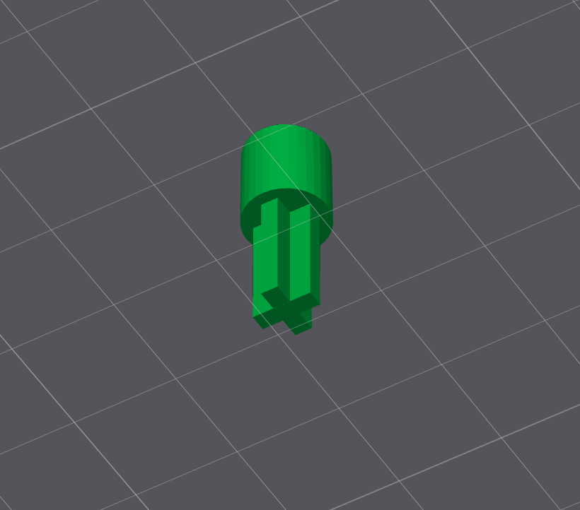

# POM-16-Poti
A Replacement for a Potentiometer Attachment for the Teenage Engineering Pocket Operator Modular 16

The bottom snaps tightly and turns smoothly. The Top Cross Part is not yet adapted correctly.

